# Gustavo Rutkowski Lara
- 🇧🇷 Brazilian
- 💻 Full-Stack Developer
- 📕 Studying: React, Spring, Redis

---

## Skills
### Front-End & UI

### Back-End

### Operating Systems and Command Line

### IDE and Other Tools

---

---

  
  
   

**Thank you very much for your attention!**
